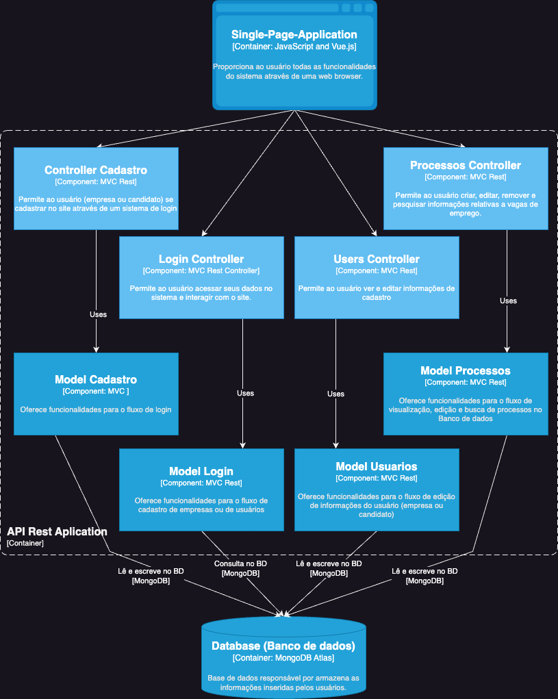

# **Diagrama C3 - Nivel 3 (Componentes)**

# **Principais componentes da Aplicação**

- **Login Controller:**  Permite que usuários e empresas acessem o site e iniciem uma sessão.

- **Cadastro Controller:** Permite que novos usuários e empresas criem contas no site.

- **Usuários Controller:** Permite ao usuário ver e editar informações de cadastro.

- **Processos Controller:** Permite a criação, atualização, remoção e busca por processos de vagas de empregos e informações sobre como candidatos a vaga (usuário tipo empresa) Permite também pesquisar vagas de empregos, se candidatar a uma vaga (usuário tipo pessoa física).

- **Login Model:** Oferece funcionalidades de autenticação para o fluxo de login, validando na base de dados as informações de tentativa de login e, caso bem sucedida, fornecendo um token que valida a sessão.

- **Cadastro Model:** Oferece funcionalidades para o fluxo de cadastro, validando os campos inseridos e adicionando novos usuários ou novas empresas na base de dados.

- **Usuários Model:** Oferece funcionalidades para o fluxo de edição de informações do usuário, atualizando e buscando na base de dados as informações do usuário atual.

- **Processos Model:** Oferece funcionalidades para o fluxo de visualização de processos, criando, removendo, atualizando e buscando informações sobre os processos em aberto na base de dados. Também possibilita que empresas consultem informações a respeito de seus próprios processos já encerrados.

# **Estilos Arquiteturais Utilizados**

- **Rest API baseado em HTTP para backend**
A partir de métodos HTTP é possível manipular recursos da aplicação, por exemplo: podemos fazer uma requisição de POST /usuario/cadastro ou /empresa/cadastro para inserir novos usuários ou empresas.

- **MVC (Model- View - Controller)**
Na aplicação web, as interfaces do Vue.js utilizam desse estilo para gerar interfaces gráficas no browser do usuário.
